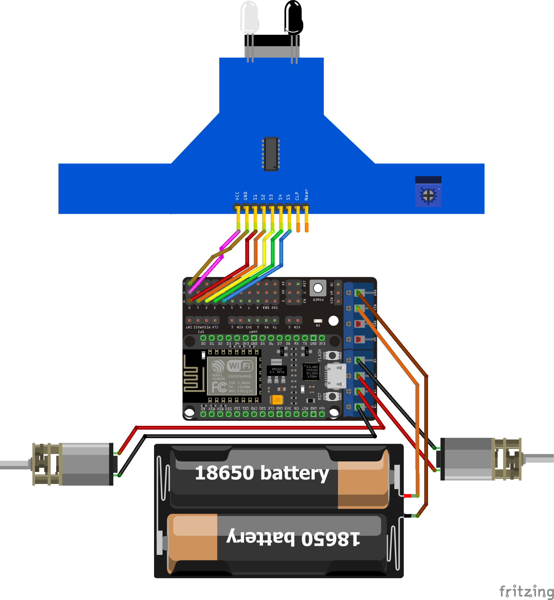

# robocamp-linefollower

Source code and resources for UMN Robocamp 2025: Line follower.

Team: OERO

## Parts used

- **ESP12E**: Microcontroller
- **ESP12E Motor Shield**: Motor driver and expansion board
- **BFD-1000**: 5 array IR Sensor
- **GA12-N20 DC Motor (300RPM)**
- **Shaft "D" Compatible wheels**
- **Steel Ball Universal W420**
- **M3 spacers, screws, and nuts**
- Custom 3D printed parts

## License

Everything in this repo is under the [MIT License](LICENSE).
